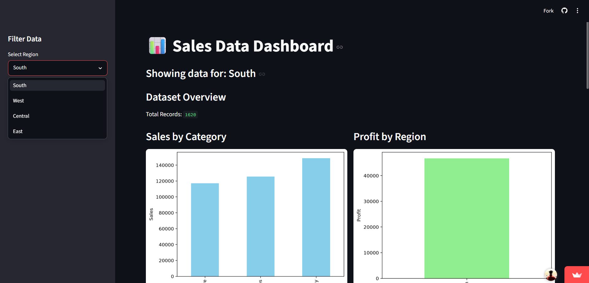

## 🛠 Tech Stack

<b>Pandas</b> • <b>NumPy</b> • <b>Matplotlib</b> • <b>Seaborn</b> • <b>Scikit-learn</b> • <b>Streamlit</b>

<h1 align="center">🤖 Data Science & Machine Learning Portfolio</h1>

  
  
  
  

A curated portfolio showcasing my work in <b>Data Science</b>, <b>Machine Learning</b>, and <b>Data Visualization</b> through real-world projects focused on exploratory data analysis, data cleaning, predictive modeling, and interactive dashboards.

  
  
  
  

## 📚 Table of Contents

* [About](#-about-this-repository)
* [Portfolio Highlights](#-portfolio-highlights)
* [Project Showcase](#-project-showcase)
* [Tech Stack](#-tech-stack)
* [Skills Demonstrated](#-skills-demonstrated)
* [Contact](#-connect-with-me)
* [License](#-license)

---

## 📌 About This Repository

This repository is the central portfolio for my Machine Learning and Data Science projects. It brings together my best work in one organized place so that recruiters, developers, and collaborators can quickly understand the kinds of problems I solve and the tools I use.

The projects in this portfolio cover the full workflow of a data project: data cleaning, exploratory data analysis (EDA), visualization, statistical insights, model building, evaluation, and dashboard deployment. Each project is maintained in its own dedicated repository, while this page acts as a clean, professional showcase.

---

## 📊 Portfolio Highlights

| Metric                      |                                            Value |
| --------------------------- | -----------------------------------------------: |
| Projects                    |                                                3 |
| Dashboards                  |                                                2 |
| Machine Learning Algorithms |                                               6+ |
| Primary Language            |                                           Python |
| Core Libraries              | Pandas, NumPy, Matplotlib, Seaborn, Scikit-learn |
| Deployment                  |                                        Streamlit |

---

## 🚀 Project Showcase

### 1) ⚽ FIFA Player Market Value Analysis

  

  
  
  
  
  

Performed exploratory data analysis on FIFA player data to identify the factors influencing player market value. The project includes statistical summaries, correlation analysis, outlier detection, multivariate insights, and an interactive Streamlit dashboard for visual exploration.

**Key Highlights**

* Statistical summaries and distribution analysis
* Correlation heatmap and relationship analysis
* Outlier detection for market value patterns
* Interactive dashboard for data exploration

  
  

---

### 2) 🛒 Superstore Data Cleaning & Visualization

  

  
  
  
  
  

Focused on data cleaning, preprocessing, and visualization using the Superstore dataset. This project presents sales and profit analysis through multiple visualizations and an interactive dashboard built with Streamlit.

**Key Highlights**

* Data cleaning and preprocessing workflow
* Sales and profit analysis
* Multiple visualizations for business insights
* Interactive dashboard with filters

  
  

---

### 3) 🤖 Predictive Modeling Using Machine Learning

  
  
  
  
  

Built multiple machine learning models to predict outcomes across different datasets. The project demonstrates an end-to-end supervised learning workflow, including data preprocessing, model training, evaluation, and performance visualization.

**Algorithms Used**

| Algorithm           | Dataset       | Task                  |
| ------------------- | ------------- | --------------------- |
| Logistic Regression | Titanic       | Survival Prediction   |
| Decision Tree       | Heart Disease | Disease Detection     |
| Random Forest       | Loan Dataset  | Loan Approval         |
| SVM                 | Diabetes      | Diabetes Prediction   |
| KNN                 | Iris          | Flower Classification |
| Naive Bayes         | Spam          | Spam Detection        |

**Key Highlights**

* Multiple ML models across different datasets
* Model evaluation with accuracy, confusion matrix, and ROC curve
* Practical workflow covering preprocessing to prediction
* Strong foundation in supervised learning concepts

  

---

## 🛠 Tech Stack

  
  
  
  
  
  
  
  
  

---

## 💡 Skills Demonstrated

  
  
  
  
  
  
  

---

## 📈 Project Snapshot

| Project                                    | Category                      | Core Skills                                    | Demo       |
| ------------------------------------------ | ----------------------------- | ---------------------------------------------- | ---------- |
| FIFA Player Market Value Analysis          | EDA + Dashboard               | Python, Pandas, Seaborn, Streamlit             | Live       |
| Superstore Data Cleaning & Visualization   | Data Cleaning + Visualization | Python, Pandas, Matplotlib, Seaborn, Streamlit | Live       |
| Predictive Modeling Using Machine Learning | ML + Evaluation               | Python, Scikit-learn, Model Evaluation         | Repository |

---

## 🎯 What This Portfolio Demonstrates

* Exploratory Data Analysis (EDA)
* Data cleaning and preprocessing
* Statistical and correlation analysis
* Data visualization and storytelling
* Machine learning model development
* Model evaluation and comparison
* Interactive dashboard deployment

---

## 🤝 Connect With Me

  
  

---

## 📄 License

This portfolio repository is licensed under the MIT License.
